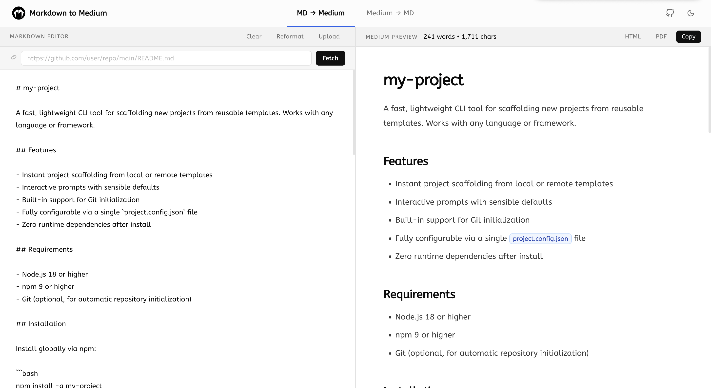

# M2M

A bidirectional converter between Markdown (`.md`) files and Medium articles.

- **MD → Medium** — write in Markdown, preview as Medium-style HTML, copy to clipboard, and paste directly into the Medium editor. Tables are automatically rendered as images (as Medium doesn't support native tables).
- **Medium → MD** — paste a Medium article URL and get a clean Markdown file with all images downloaded at full resolution, packaged as a ZIP.



> [!IMPORTANT]
> This tool is hosted on **Render (free tier)**, so the initial load may take a few moments. Your content is processed temporarily and **no private drafts are stored in external databases**.

## Prerequisites

- **Node.js** 18 or later
- **npm** 9 or later

## Installation & Setup

1. Install dependencies:

   ```bash
   npm install
   ```

2. Start the API server (port 3001) and Vite dev server (port 5173):

   ```bash
   npm run dev
   ```

3. Access the application at `http://localhost:5173`.

### Environment variables

Create a `.env` file in the root directory (this file is used by both the backend and Docker).

| Variable       | Default                | Description                                                                                              |
| -------------- | ---------------------- | -------------------------------------------------------------------------------------------------------- |
| `PORT`         | `3001`                 | API server port                                                                                          |
| `PORT_CLIENT`  | `5173`                 | Vite dev server port                                                                                     |
| `HOST`         | `localhost`            | Bind address for both servers. Set to `0.0.0.0` to expose on the network (e.g. inside a VM or container) |
| `FREEDIUM_URL` | `https://freedium.cfd` | Primary Freedium mirror for bypassing Medium paywalls                                                    |

## Features

### Markdown to Medium (MD → Medium)

- **Smart Editor**: Write Markdown using familiar IDE-like shortcuts (auto-closing brackets, `Ctrl+B` for bold, `Ctrl+I` for italics, `Ctrl+K` for links, and `Ctrl+/` for comments).
- **Import from Web**: Fetch `.md` documents directly from the internet via raw URLs (like GitHub or GitLab).
- **Upload Files & Folders**: Upload individual files or entire folders to automatically render and embed local image paths in your browser.
- **Auto-Formatting**: Instantly clean and restructure your messy Markdown code with a single click.
- **Table to Image**: Automatically converts Markdown tables into high-quality fallback images (since Medium does not natively support tables).
- **Synchronized Scrolling**: The raw editor and visual preview pane are tightly synced, allowing you to seamlessly edit long documents side-by-side.
- **Nested List Formatting**: Deeply nested bullet points and numbered sub-lists are aggressively formatted into logical paragraph hierarchies to prevent Medium's editor from breaking them into single generic lists upon pasting.
- **Live Preview**: See a real-time preview of exactly how your draft will appear on Medium, including live word and character counts.
- **Admonitions**: Seamlessly convert GitHub-style callouts (e.g., `> [!NOTE]`) into beautiful Medium quote blocks.
- **Flexible Export**: One-click copy the rich text to paste straight into Medium, or export your work offline as standalone HTML or a fully-paged PDF.

### Medium to Markdown (Medium → MD)

- **Instant Extraction**: Paste any Medium article URL and watch it instantly transform back into a clean, standardized Markdown file.
- **Full-Quality Images**: Automatically downloads all article images at their maximum, uncompressed original resolution (up to 4800px).
- **Bypass Cache**: Force the tool to fetch the absolute latest version of an article if an outdated version is stuck in Medium's cache (Note: this feature cannot bypass Medium paywalls, and paywalled articles should be grabbed via Freedium links).
- **Flexible Export**: Seamlessly copy the generated Markdown directly to your clipboard, or hit the Download button to package the `.md` file alongside an `images/` directory into a secure ZIP archive for offline storage. The resulting pure Markdown tree can also be directly exported to standalone HTML or dynamic PDF formats natively within the UI.
- **Quick Image Copying**: Easily copy individual extracted article images directly to your system clipboard with a single click via the preview pane.

> [!NOTE]
> Images won't copy directly to your clipboard when using the "Copy Markdown" button. A manual "Copy Image" button is provided by hovering over any previewed image.

## License

This project is licensed under Apache 2.0. See [LICENSE](LICENSE).
